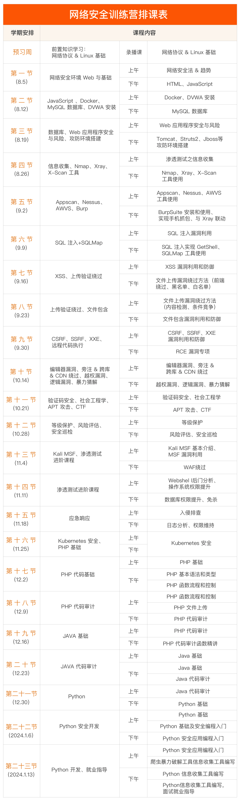

# 网络安全训练营

👉 知识库地址：[https://wukaipeng.com/technique/net-security/introduction](https://wukaipeng.com/technique/net-security/introduction)

## 六大方向

1. Web 安全
2. 网络安全
3. 信息安全
4. 系统防护
5. 供方渗透
6. 云安全

## 学习模块

1. 基础阶段
   1. 模块一：基础前置知识掌握
   2. 模块二：网络安全入门核心知识
   3. 模块三：信息安全基础
   4. 模块四：信息安全工具使用
   5. 模块五：渗透测试
   6. 模块六：等级保护*
   7. 模块七：风险评估*
   8. 模块八：安全巡检*
2. 进阶阶段
   1. 模块九：信息安全工具使用（Kail 之 MSF 渗透测试）
   2. 模块十：渗透测试进阶
   3. 模块十一：应急响应
   4. 模块十二：代码审计
   5. 模块十三：代码审计进阶
   6. 模块十四：Kubernetes 安全
   7. 模块十五：安全开发

## 课表

